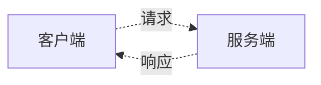
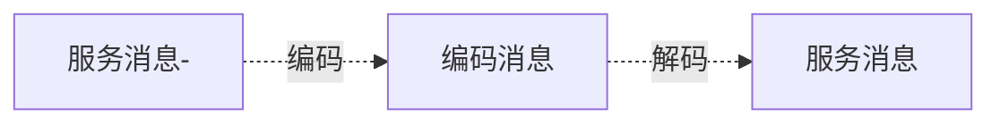

# 微服务基础知识

要说清楚微服务，就要先说清楚单体架构。  

单体架构简单地说，即所有的业务功能都由一个程序或一个进程提供。一个程序就完成所需要的所有功能。常见的 Web 服务基本都是一个服务完成了所有业务功能，但随着业务的增加，越来越多的服务交织在一起。当业务代码没有做好模块化的时候，修改某个服务的代价越来越高，维护一个整个服务的成本越来越高，可读性有越来越差。   

单体架构也被称为 巨石架构 （monolithic software）

因此出现了一种架构思想，SOA（service-oriented architecture）定义了一种可通过服务接口复用软件组件并实现其互操作的方法。  
将整体的业务抽成许多个独立的服务，服务与服务之间可以互相调用并且可以独立部署。这样带来的优势有很多  
1、某个服务崩溃了，即单点故障，不会影响其他服务的正常运行，不过依赖该服务的服务可能会受到影响。  
2、当服务被拆分后，每个服务都是独立的并对外提供服务，单个服务只需要确保自身的服务没问题，不需要考虑其他服务，大大降低的开发和后续维护的难度。  
3、提高了服务的可用性，可以增加某些服务的部署数量，将业务压力较大的服务增加服务提供实例的个数，并通过负载均衡达到高可用的目的，与分布式类似。  
4、可以构成异构的服务体系，即使用 C++ 完成部分需要较高运算效率的服务，GO 完成 Web 部分的服务，不同语言完成的服务可以通过 统一的通讯协议，互相调用。

困难：
1、服务的拆分需要仔细考虑，服务拆分的粒度也需要仔细考虑，粒度过小，增加重复地工作了，由于每个服务都需要大量地基础设置  
2、整体服务的测试  
4、循环调用
5、服务不可用  
6、服务互相之间如何知道对方，对方的状态，是否可用

为了解决上述的困难引入了如下的概念：
1、注册中心，在多个相同的服务时，引入了负载均衡的策略
2、熔断、降级、限流
3、链接追踪
4、数据统计
5、日志系统

请求编解码
在 RPC 调用的过程中，存在请求响应的编解码过程，以 gRPC 为例子， gRPC 通过定义了 protobuf 的数据对象，服务端接收到请求后需要对请求解码，解码出服务需要的数据，  
在服务调用完成后将响应数据经过编码后返回，而客户端的操作与之相反，客户端调用服务，发送请求，需要把请求数据经过编码，然后发送给服务端，服务端返回的数据，数据需要  
解码，然后就是响应的数据。

消息可以分为两种消息 请求与响应消息 分别对应服务的输入参数与输出参数

#### 参考链接

[微服务是什么？](https://www.ruanyifeng.com/blog/2022/04/microservice.html)
[软件工程的最大难题](https://www.ruanyifeng.com/blog/2021/05/scaling-problem.html)
[Go kit: Go in the modern enterprise](http://peter.bourgon.org/go-kit/)